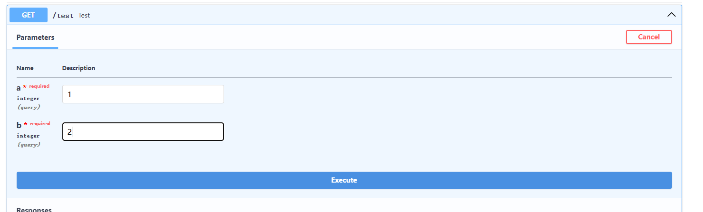

1、构建后端
构建您的后端代码，在实例化fastapi时，在其中设置servers属性

```python
# 将其中的url替换为您的地址
app = FastAPI(servers=[{"url": "http://0.0.0.0:8000"}])

# 构建您的核心代码
# @app.get('/test')，其中的test为路由地址，可根据个人喜好进行修改
# def test中的test是函数名称，也可根据个人喜好修改，两者不必一致
@app.get('/test')
def test(params):
    """您的业务代码(您可以先构建您的业务代码，使用ChatGPT或其他大模型生成基于Fastapi生成的后端)"""
    return result
```

比如您的核心代码时计算A+B的结果，
```python
def test(A, B):
    return A+B
```

访问chatgpt生成后端，如下


完整的demo如下:
```python
# demo.py
from fastapi import FastAPI
from fastapi.responses import JSONResponse
from types import Union
import uvicorn

# 在实例化FastAPI时，通过servers参数指定OpenAPI文档的服务器地址(请根据实际情况填写地址)
# 若该项目已部署在服务器，需将其转化为外网可访问端口
app = FastAPI(servers=[{"url": "http://0.0.0.0:8000"}])

@app.get("/test")
async def test(A: Union[int, float], B: Union[int, float]):
    result = A + B
    return JSONResponse(content={"result": result})

if __name__ == "__main__":
    uvicorn.run(app, host="0.0.0.0", port=8000)
```

在命令行输入以下命令，运行上述文件
注意:请将路径切换至主函数所在目录,
例如我主函数的路径为D:/python_file/opentarget_api/demo.py
而我当前路径为D:/python_file/opentarget_api/core，则需要
```sh
# 返回上一层界面
cd ..
```
，再运行以下命令，python后面的文件名称根据您的文件名称进行修改
```sh
python demo.py
```

在运行完上述命令后会在命令行会出现如下提示，


按住Ctrl + 鼠标左键点击下图所示的地址(http://0.0.0.0:8000),由于设置不同，url地址也会不同


点开后会看到如下图所示内容


我们在搜索框的地址后面加入/docs,回车

就会出现如下所示


点击向下箭头


点击try it out


在输入框中输入参数，请根据您的业务代码所需求参数类型填写


点击execute,等待片刻，
若出现如下所示，则调用失败


成功调用则会出现以下内容


当成功时点击fastapi下的openapi.json


点击后如下


勾选美观输出后
Ctrl+A全选
Ctrl+C复制

2、将刚复制的json导入到sciminder(https://sciminer.protonunfold.com/signin)上的自定义组件上，点击保存即可创建自定义组件函数
点击上述链接，进入登陆页面


登陆后，进入主页面


点击自定义


点击创建自定义工具,填入工具名称和将刚复制的json内容粘贴到schema中


点击保存


点开该自定义工具


